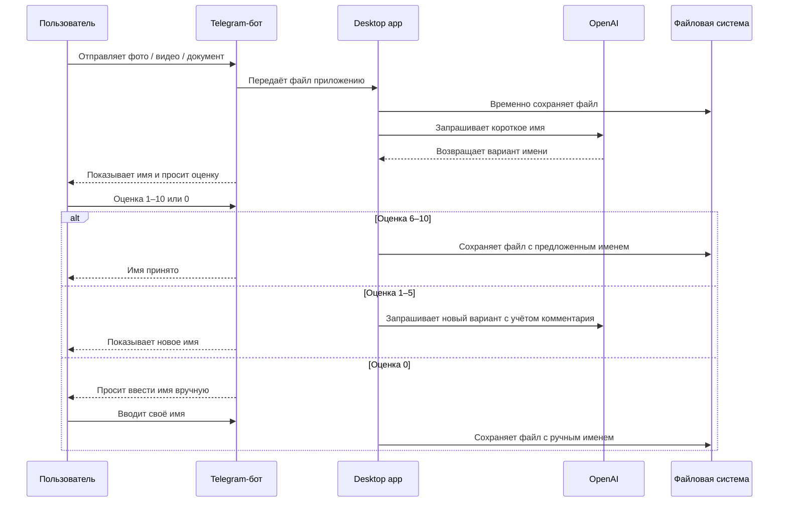

# AIFA Max — AI File Assistant


**AIFA Max** — это Telegram-бот и десктопное приложение для Windows, которое принимает файлы из Telegram, сохраняет их на компьютер и помогает давать им понятные имена с помощью OpenAI.

Проект создан как персональный AI-ассистент для переноса, сортировки и переименования фото, видео и документов.

---

## Содержание

- [О проекте](#о-проекте)
- [Что решает AIFA Max](#что-решает-aifa-max)
- [Основные возможности](#основные-возможности)
- [Как это работает](#как-это-работает)
- [Режимы работы](#режимы-работы)
- [Интерфейс](#интерфейс)
- [Технологический стек](#технологический-стек)
- [Требования](#требования)
- [Установка](#установка)
- [Переменные окружения](#переменные-окружения)
- [Конфигурация](#конфигурация)
- [Запуск](#запуск)
- [Использование](#использование)
- [Файлы проекта](#файлы-проекта)
- [Рекомендации для GitHub](#рекомендации-для-github)
- [Известные ограничения](#известные-ограничения)
- [Roadmap](#roadmap)
- [Автор](#автор)
- [Лицензия](#лицензия)

---

## О проекте

Когда файлы постоянно переносятся с телефона на компьютер, они часто сохраняются с техническими именами вроде:

```text
IMG_2451.jpg
video_001.mp4
scan_03.pdf
document_123.docx
```

Через некоторое время становится сложно понять, что находится внутри файла, где лежит нужная фотография, какой документ относится к какому событию или проекту.

**AIFA Max** автоматизирует этот процесс:

```text
Telegram → Windows PC → AI naming → оценка пользователя → сохранение файла
```

Пользователь отправляет файл в Telegram-бота, приложение скачивает его на компьютер, предлагает короткое осмысленное имя на русском языке и даёт возможность принять вариант, запросить новый или ввести имя вручную.

Текущая версия проекта — рабочий **single-file MVP**: один Python-файл содержит Telegram-бота, GUI на Tkinter, OpenAI-логику, настройки, контроль доступа и обработку файлов.

---

## Что решает AIFA Max

AIFA Max помогает:

- быстро переносить файлы с телефона на ПК через Telegram;
- автоматически сортировать фото, видео и документы по папкам;
- заменять технические имена файлов на понятные;
- экономить время на ручном переименовании;
- собирать личный или рабочий архив без хаоса в названиях;
- использовать AI-подсказки, но оставлять финальное решение за пользователем.

Проект может быть полезен фотографам, контент-мейкерам, SMM-специалистам, преподавателям, фрилансерам, небольшим командам и всем, кто часто работает с входящими файлами.

---

## Основные возможности

- **Приём файлов из Telegram**: фото, видео и документы.
- **Сохранение на Windows PC** в отдельные папки для фото, видео и документов.
- **Генерация коротких русских названий** через OpenAI.
- **AI-режим On/Off**: можно использовать автоматическое именование или полностью ручной ввод.
- **Режим “Одним именем”**: единый префикс для серии файлов.
- **Оценка предложенного имени** от `1` до `10`.
- **Повторная генерация** при низкой оценке.
- **Ручной ввод имени** при оценке `0`.
- **Учёт обратной связи**: комментарии и оценки используются при следующих попытках генерации.
- **Whitelist-доступ**: бот доступен только разрешённым Telegram-пользователям.
- **GUI-запрос доступа**: новый пользователь отправляет `/start`, администратор подтверждает или отклоняет доступ в desktop-окне.
- **Настройки OpenAI**: выбор модели GPT из интерфейса.
- **Редактирование промта** для генерации названий.
- **Настройка цветовой схемы** интерфейса.
- **Отдельный режим анализа фото**: загрузка изображения с компьютера, ввод промта и получение описания через GPT-4o.
- **Подсчёт токенов** и примерная оценка стоимости использования AI.
- **Логирование** в `bot.log`.
- **System tray**: приложение можно свернуть и оставить работать в фоне.
- **Статус соединения** через бегущую строку с числом π.

---

## Как это работает



Логика оценки:

| Оценка | Действие |
|---|---|
| `6–10` | Имя принимается |
| `1–5` | Бот предлагает новый вариант |
| `0` | Пользователь вводит имя вручную |

---

## Режимы работы

### AI Mode: On

Приложение использует OpenAI для генерации имени файла.

Подходит для:

- фотографий с непонятными названиями;
- документов с техническими именами;
- быстрой сортировки входящих файлов;
- случаев, когда нужно получить короткое понятное название;
- пакетной обработки материалов с похожим контекстом.

### AI Mode: Off

OpenAI не используется. Бот просит пользователя ввести имя вручную.

Подходит для:

- экономии токенов;
- полного ручного контроля;
- файлов, которые не нужно анализировать через AI;
- случаев, когда нужное имя уже известно заранее.

### One Name Mode / «Одним именем»

Режим для серии файлов. Например, если пользователь отправляет несколько фотографий одного события, приложение может сохранить их так:

```text
поездка в прагу 1.jpg
поездка в прагу 2.jpg
поездка в прагу 3.jpg
```

Режим можно комбинировать с AI Mode:

| AI Mode | One Name Mode | Поведение |
|---|---|---|
| On | Off | AI предлагает отдельное имя для каждого файла |
| On | On | AI предлагает одно имя серии, файлы получают нумерацию |
| Off | Off | Пользователь вручную вводит имя каждого файла |
| Off | On | Пользователь вручную вводит имя серии |

---

## Интерфейс

AIFA Max имеет desktop-интерфейс на Tkinter.

В главном окне доступны:

- выбор папки для фото;
- выбор папки для видео;
- выбор папки для документов;
- статус Telegram-бота;
- последнее имя файла;
- счётчик токенов;
- примерная стоимость использования AI;
- переключатель AI-режима;
- переключатель режима «Одним именем»;
- кнопка сброса токенов;
- меню настроек;
- окно «О боте»;
- окно «Анализ фото»;
- сворачивание в system tray.

В меню **Настройки** доступны:

- редактирование промта для названий;
- выбор модели OpenAI;
- управление списком разрешённых пользователей;
- изменение цветовой схемы интерфейса.

---

## Скриншоты

Добавьте изображения в папку `assets/` и раскомментируйте блок ниже:

```markdown


```

Рекомендуемые скриншоты для GitHub:

- главное окно программы;
- меню настроек;
- окно управления доступом;
- режим анализа фото;
- диалог с Telegram-ботом;
- пример сохранённого файла на диске.

---

## Технологический стек

| Компонент | Технология |
|---|---|
| Язык | Python 3.10+ |
| Telegram-бот | python-telegram-bot |
| AI | OpenAI API |
| OpenAI client | AsyncOpenAI |
| GUI | Tkinter / ttk |
| System tray | pystray |
| Изображения | Pillow, base64 |
| HTTP-запросы | requests |
| Конфигурация | JSON |
| Хранение истории | JSON |
| Логирование | logging |
| Целевая ОС | Windows 10/11 |

---

## Требования

Перед запуском нужны:

- Windows 10/11;
- Python 3.10 или новее;
- Telegram-бот, созданный через [@BotFather](https://t.me/BotFather);
- OpenAI API key;
- Telegram chat ID администратора;
- доступ к Telegram API и OpenAI API.

Минимальный набор Python-зависимостей:

```text
python-telegram-bot>=21.0
openai>=1.0.0
requests>=2.31.0
Pillow>=10.0.0
pystray>=0.19.0
```

`tkinter`, `asyncio`, `json`, `logging`, `threading`, `pathlib`, `uuid`, `decimal`, `base64`, `re` входят в стандартную библиотеку Python или поставляются вместе с Python-сборкой.

---

## Установка

### 1. Клонировать репозиторий

```bash
git clone https://github.com/mirolab256/aifa-max-bot.git
cd aifa-max-bot
```

### 2. Создать виртуальное окружение

```bash
python -m venv .venv
```

### 3. Активировать окружение

PowerShell:

```powershell
.\.venv\Scripts\Activate.ps1
```

cmd.exe:

```bat
.venv\Scripts\activate
```

### 4. Установить зависимости

Если в репозитории есть `requirements.txt`:

```bash
pip install -r requirements.txt
```

Если файла пока нет:

```bash
pip install python-telegram-bot openai requests Pillow pystray
```

Рекомендуемый `requirements.txt`:

```text
python-telegram-bot>=21.0
openai>=1.0.0
requests>=2.31.0
Pillow>=10.0.0
pystray>=0.19.0
```

---

## Переменные окружения

Приложение не хранит Telegram- и OpenAI-токены в коде. Ключи берутся из переменных окружения.

Схема переменных:

```text
AIFA_MAX_PROFILE
AIFA_MAX_<PROFILE>_TELEGRAM
AIFA_MAX_<PROFILE>_OPENAI
CREATOR_CHAT_ID
```

По умолчанию используется профиль `DEFAULT`.

### Минимальный набор для PowerShell

```powershell
$env:AIFA_MAX_PROFILE = "DEFAULT"
$env:AIFA_MAX_DEFAULT_TELEGRAM = "YOUR_TELEGRAM_BOT_TOKEN"
$env:AIFA_MAX_DEFAULT_OPENAI = "YOUR_OPENAI_API_KEY"
$env:CREATOR_CHAT_ID = "YOUR_TELEGRAM_CHAT_ID"
```

### Пример с другим профилем

```powershell
$env:AIFA_MAX_PROFILE = "WORK"
$env:AIFA_MAX_WORK_TELEGRAM = "YOUR_WORK_TELEGRAM_BOT_TOKEN"
$env:AIFA_MAX_WORK_OPENAI = "YOUR_WORK_OPENAI_API_KEY"
$env:CREATOR_CHAT_ID = "YOUR_TELEGRAM_CHAT_ID"
```

В этом случае приложение будет искать:

```text
AIFA_MAX_WORK_TELEGRAM
AIFA_MAX_WORK_OPENAI
```

### Постоянная установка переменных через setx

```powershell
setx AIFA_MAX_PROFILE "DEFAULT"
setx AIFA_MAX_DEFAULT_TELEGRAM "YOUR_TELEGRAM_BOT_TOKEN"
setx AIFA_MAX_DEFAULT_OPENAI "YOUR_OPENAI_API_KEY"
setx CREATOR_CHAT_ID "YOUR_TELEGRAM_CHAT_ID"
```

После `setx` откройте новое окно терминала, чтобы переменные стали доступны.

---

## Конфигурация

Основные настройки приложения хранятся локально в `config.json`.

Пример структуры:

```json
{
  "doc_dir": "C:/Users/User/Documents",
  "photo_dir": "C:/Users/User/Pictures",
  "video_dir": "C:/Users/User/Videos",
  "token_price_usd": 0.15,
  "openai_model": "gpt-4o-mini",
  "ui_color": "#6a0dad",
  "ui_color_light": "#b57bff",
  "allowed_users": [],
  "naming_prompt": ""
}
```

Описание полей:

| Поле | Назначение |
|---|---|
| `doc_dir` | Папка для документов |
| `photo_dir` | Папка для фотографий |
| `video_dir` | Папка для видео |
| `token_price_usd` | Условная цена токенов для расчёта стоимости |
| `openai_model` | Модель OpenAI для генерации имён |
| `ui_color` | Основной цвет интерфейса |
| `ui_color_light` | Светлая версия цвета интерфейса |
| `allowed_users` | Список разрешённых Telegram-пользователей |
| `naming_prompt` | Пользовательский промт для генерации названий |

> В старых вариантах конфигурации может встречаться поле `allowed_ids`. Для актуального оформления репозитория рекомендуется использовать единый формат `allowed_users`.

Пример пользователя в `allowed_users`:

```json
{
  "id": 123456789,
  "name": "User Name",
  "login": "@username"
}
```

---

## Запуск

Рекомендуется назвать основной файл приложения:

```text
aifa_max.py
```

Тогда запуск:

```bash
python aifa_max.py
```

Если файл пока называется иначе, например `AIFA(2).py`, запустите его по текущему имени:

```bash
python "AIFA(2).py"
```

После успешного запуска:

- откроется desktop-окно AIFA Max;
- приложение проверит Telegram-токен;
- запустится Telegram-бот;
- в GUI появится статус запуска;
- приложение можно свернуть в system tray.

---

## Использование

### 1. Запустите приложение

```bash
python aifa_max.py
```

### 2. Выберите папки сохранения

В главном окне укажите папки для:

- фото;
- видео;
- документов.

### 3. Напишите боту `/start`

В Telegram откройте своего бота и отправьте:

```text
/start
```

Если пользователь ещё не находится в whitelist, администратор увидит GUI-запрос на доступ и сможет разрешить или отклонить его.

### 4. Отправьте файл

Поддерживаются:

- фотографии;
- видео;
- документы.

### 5. Оцените предложенное имя

Бот предложит имя и попросит оценку:

```text
Оцените 1-10 (≤5 — ещё вариант, 0 — своё имя)
```

- `6–10` — имя принимается;
- `1–5` — бот предлагает новый вариант;
- `0` — бот попросит ввести имя вручную.

### 6. Файл сохраняется на диск

После принятия имени файл остаётся в выбранной папке уже с нормальным названием.

---

## Анализ фото

В приложении есть отдельный режим **«Анализ фото»**.

Сценарий:

1. пользователь выбирает изображение на компьютере;
2. вводит свой промт;
3. приложение отправляет изображение в OpenAI в формате base64;
4. получает текстовое описание;
5. показывает результат в отдельном окне.

Эта функция может использоваться для:

- описания фотографий;
- подготовки подписей;
- анализа содержимого изображения;
- генерации идей для названия;
- быстрого понимания, что изображено на фото.

---

## Управление доступом

Бот не открыт для всех пользователей.

Когда новый пользователь отправляет `/start`, приложение:

1. отправляет уведомление администратору;
2. показывает desktop-окно с Telegram ID, именем и логином пользователя;
3. предлагает разрешить или отклонить доступ;
4. при подтверждении добавляет пользователя в whitelist.

Это делает проект пригодным для личного использования или закрытого командного сценария.

---

## Файлы проекта

Рекомендуемая структура репозитория:

```text
aifa-max-bot/
├─ README.md
├─ requirements.txt
├─ .gitignore
├─ LICENSE
├─ aifa_max.py
├─ assets/
│  ├─ screenshot-main.png
│  ├─ screenshot-settings.png
│  └─ screenshot-telegram-flow.png
└─ docs/
   ├─ usage.md
   └─ roadmap.md
```

Текущие runtime-файлы приложения:

```text
config.json          # локальные настройки приложения
bot.log              # логи работы
name_history.json    # история предложенных имён и оценок
ratings.json         # резервный файл для оценок, если используется в вашей версии
```

Эти файлы обычно не стоит коммитить в публичный репозиторий.

---

## Рекомендации для GitHub

### .gitignore

```gitignore
# Virtual environments
.venv/
venv/

# Python cache
__pycache__/
*.pyc
*.pyo

# Local secrets and config
.env
config.json

# Runtime files
bot.log
*.log
name_history.json
ratings.json

# OS files
.DS_Store
Thumbs.db

# IDE
.vscode/
.idea/
```

### .env.example

Даже если приложение читает системные переменные окружения, полезно добавить пример:

```env
AIFA_MAX_PROFILE=DEFAULT
AIFA_MAX_DEFAULT_TELEGRAM=your_telegram_bot_token
AIFA_MAX_DEFAULT_OPENAI=your_openai_api_key
CREATOR_CHAT_ID=your_telegram_chat_id
```

Важно: само приложение сейчас не загружает `.env` автоматически. Этот файл нужен как пример для пользователя.

### Минимальный smoke test

```bash
python -m py_compile aifa_max.py
```

Ожидаемый результат: команда завершается без вывода и без ошибок.

---

## Известные ограничения

Текущая версия — рабочий MVP, поэтому есть ограничения:

- проект пока реализован как один большой Python-файл;
- основная целевая платформа — Windows;
- поддержка Linux/macOS не проверена и требует адаптации;
- версии зависимостей желательно зафиксировать в `requirements.txt`;
- локальные runtime-файлы не должны попадать в Git;
- OpenAI- и Telegram-токены должны храниться только в переменных окружения;
- для публичного релиза стоит нормализовать название основного файла до `aifa_max.py`;
- формат `allowed_users` и старый `allowed_ids` лучше привести к единой схеме;
- автоматические тесты пока не оформлены как отдельный test suite;
- `.exe`-сборка для Windows пока не описана как стабильный релизный процесс.

---

## Roadmap

Планы развития:

- [ ] Добавить стабильный `requirements.txt`.
- [ ] Добавить `.env.example`.
- [ ] Добавить `.gitignore`.
- [ ] Добавить файл `LICENSE`.
- [ ] Добавить скриншоты интерфейса.
- [ ] Переименовать основной файл в `aifa_max.py`.
- [ ] Разнести single-file MVP по модулям:
  - `bot.py`;
  - `gui.py`;
  - `openai_service.py`;
  - `file_manager.py`;
  - `settings.py`;
  - `access_control.py`.
- [ ] Добавить unit-тесты для конфигурации, генерации имён и файловых операций.
- [ ] Настроить GitHub Actions.
- [ ] Улучшить обработку больших фотографий.
- [ ] Улучшить именование видео.
- [ ] Добавить расширенную статистику токенов по моделям.
- [ ] Добавить экспорт истории имён.
- [ ] Подготовить Windows `.exe`-сборку.
- [ ] Рассмотреть версии для macOS и Linux.
- [ ] Рассмотреть Telegram Mini App или web-панель администратора.

---

## Возможные коммерческие адаптации

На основе AIFA Max можно сделать:

- Telegram-бота для приёма клиентских файлов;
- AI-сортировщик документов;
- ассистента для фотоархива;
- внутренний инструмент для малого бизнеса;
- систему автоматического описания изображений;
- бота для обработки материалов от клиентов;
- desktop-приложение под конкретный рабочий процесс.

---

## Автор

**Maksim Miropolskiy**  
GitHub: [@mirolab256](https://github.com/mirolab256)

Проект создан как практическая реализация идеи умного файлового ассистента для автоматизации переноса, сохранения и переименования файлов.

---

## Лицензия

Лицензия пока не выбрана.

Для публичного open-source репозитория рекомендуется добавить файл `LICENSE`. Один из подходящих вариантов — MIT License, если вы хотите разрешить свободное использование проекта с указанием авторства.
